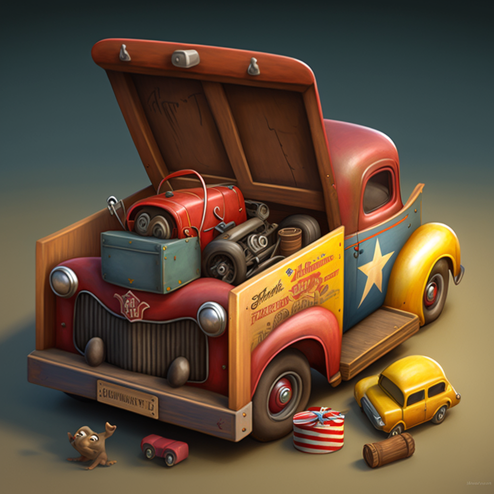

# Toybox

This repository contains a collection of assets that game developers can use to quickly prototype games for game jams or other quick turnaround projects.

## Getting Started
To get started with the assets in this repository, simply clone or download the repository and start using the assets in your own game projects. Or you can add the repository using the Unity Package Manager.

## Contents
This repository contains various assets such as:

- Fully featured rigidbody and character controllers
- HDRP-like shader which can be run in Unity Standard RP
- Manager scripts (Audio, Game...)
- Sound effects
- Icons for gizmos